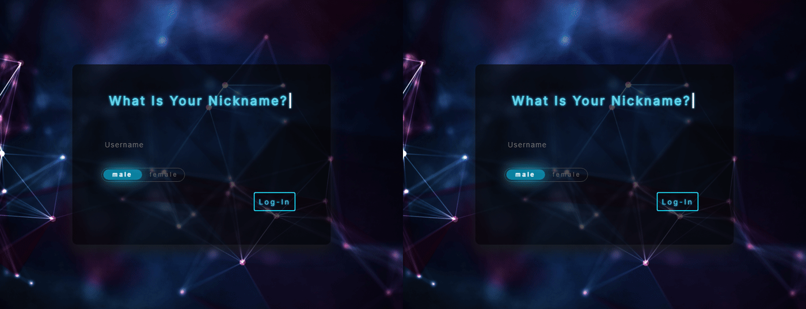
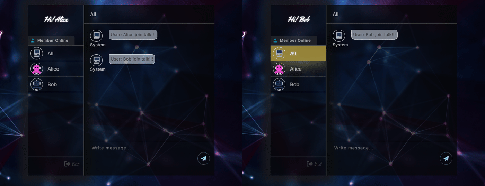

# Online Chatroom

A real-time online chatroom built with **Spring Boot** and **WebSocket (STOMP)**. The frontend is powered by **Thymeleaf**, **JavaScript**, and **jQuery**.

## Features

- **Group Chat** — Send messages to all online users in a shared public channel
- **Private Chat** — Click on any user in the sidebar to start a one-on-one private conversation
- **Live User List** — The online member list updates automatically as users join or leave
- **Gender Avatars** — Users select male or female at login and are assigned a matching avatar

## Demo

### Group Chat & Private Chat

After logging in with a nickname and selecting your gender, you will enter the chatroom where you can:
- Switch to **Group Chat** (All) to broadcast messages to everyone
- Click a **user's name** in the sidebar to switch to a one-on-one private conversation



### Exit

Click the **Exit** button to leave the chatroom. Other users will see a notification that you have left, and you will be redirected back to the login page.



## Screenshots


## Tech Stack

- **Backend**: Java 8, Spring Boot 2.6.5, Spring WebSocket, STOMP
- **Frontend**: Thymeleaf, JavaScript, jQuery, SockJS
- **Containerization**: Docker

## Run Locally

```bash
docker compose up --build
```

Then open `http://localhost:8086/chat/entry` in your browser.
Open a second browser window (or incognito) to simulate a second user.

---

> This project is for non-commercial use. Background image source: https://www.goodfon.com/abstraction/wallpaper-linii-abstrakciya-fon-tochki.html. If there is any copyright infringement, please let me know and I will take it down.
